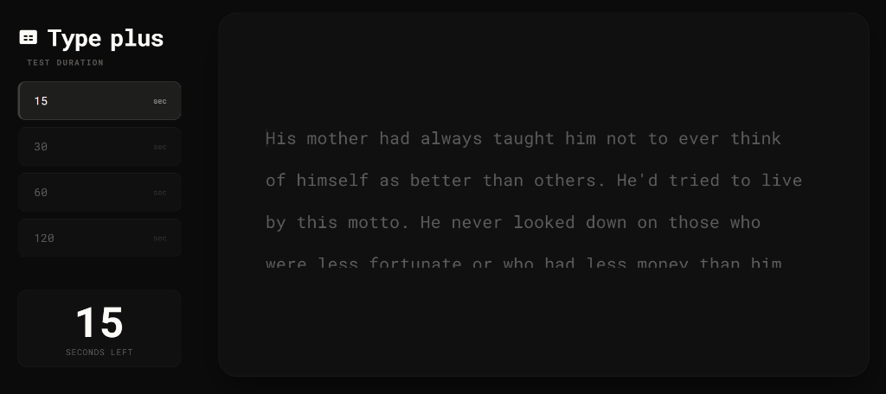

# Type plus

**A Sleek, Professional, and Modern Typing Test Dashboard**

---

## Overview

**Type plus** is a premium, pure-frontend typing test application built for developers and typists who demand a clean, distraction-free environment. Redesigned from the ground up, it ditches traditional, cluttered layouts in favor of a modern **Dashboard Style** interface.

With a deep **Obsidian** and **Milky White** theme, frosted glassmorphism elements, and seamless performance, it offers a highly focused typing experience.

## Features

- **Dashboard Interface:** A fixed left sidebar for navigation and statistics, alongside a massive central glassmorphic card for highly-focused typing.
- **Meaningful Paragraphs:** No more random, disconnected words. Type plus automatically fetches real, grammatically structured English paragraphs to simulate realistic typing flows.
- **Offline Fallback:** If your internet connection drops, the app seamlessly falls back to an internal cache of classic typing test paragraphs without interrupting your session.
- **Real-Time Analytics:** Tracks your typing keystrokes instantly, offering live visual feedback (white for correct, red for errors).
- **Comprehensive Results:** 
  - Standard WPM (Words Per Minute)
  - Raw WPM (Speed without penalty for typos)
  - Accuracy Percentage
  - Character Breakdown (Correct / Incorrect / Extra / Missed)
- **Data Visualization:** A beautiful, responsive line chart (powered by Chart.js) that maps your WPM progression second-by-second throughout the test.

## Getting Started

Because **Type plus** is a pure frontend application, there is no backend, no server, and no build process required to run it!

### Running Locally
1. Clone the repository.
2. Simply double-click the `index.html` file to open it in your default web browser. 
3. Start typing!

### Deployment
You can deploy this instantly to any static hosting provider like **Vercel**, **Netlify**, or **GitHub Pages**. Just link the repository and point it to the root directory!

## Technology Stack
- **HTML5:** Semantic structure and layout.
- **Vanilla CSS3:** Custom CSS variables, Flexbox, CSS Grid, and Glassmorphism effects (No bulky CSS frameworks required).
- **Vanilla JavaScript:** Fast, responsive DOM manipulation and event tracking.
- **Chart.js:** For rendering the smooth, anti-aliased data charts on the results screen.
- **DummyJSON API:** Fetches dynamic paragraph content on the fly.

## Design System
- **Background:** Deep Obsidian (`#0b0b0b`)
- **Accents & Active Text:** Milky White (`#fdfbf7`)
- **Inactive Elements:** Muted Gray (`#5c5c5c`)
- **Errors:** Soft Red (`#e57373`)
- **UI Elements:** Frosted Glass (`rgba(255, 255, 255, 0.02)`) with subtle borders and shadows.

---
*Built for speed. Designed for focus.*